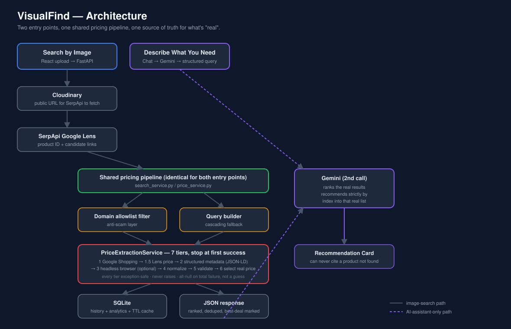

# VisualFind

VisualFind is a visual product search platform. Upload a product photo and
get purchase links with live prices from trusted e-commerce platforms only,
sorted cheapest-first with an automatic best-deal badge. As of v3, products
can also be discovered by describing what you need in plain language via an
AI shopping assistant. As of v4, everything lives behind real user accounts.

**Live demo:** [visual-find-379jgj90k-ashverya.vercel.app](https://visual-find-379jgj90k-ashverya.vercel.app/)

> **Note:** this link is the deployed React frontend. Image search and the
> AI assistant only work end-to-end on this link if the FastAPI backend is
> *also* deployed somewhere (Render/Railway/Fly — see
> [Deployment](#deployment)) and the frontend's API base URL and the
> backend's `CORS_ALLOWED_ORIGINS` both point at each other. If the backend
> isn't deployed yet, the landing page will load but a search will fail —
> in that case, lead with the demo video/screenshots below instead of the
> live link until the backend is up too.

<!--
Add 2-4 screenshots or a short GIF/Loom link here before sharing the repo:
one of the landing page, one of a completed image search with the
best-deal badge visible, and one of the AI assistant's recommendation
card. A markdown image embed looks like: 
-->

## Table of Contents

- [Overview](#overview)
- [Architecture](#architecture)
- [Why Not Live Scraping](#why-not-live-scraping)
- [Price Extraction Pipeline](#price-extraction-pipeline)
- [Security](#security)
- [Docker](#docker)
- [Scaling to Production](#scaling-to-production)
- [Known Limitations](#known-limitations)
- [Setup](#setup)
- [Why ngrok Is Needed](#why-ngrok-is-needed)
- [Deployment](#deployment)
- [Testing](#testing)
- [Troubleshooting](#troubleshooting)
- [API Reference](#api-reference)
- [Project Layout](#project-layout)
- [Trusted Platforms](#trusted-platforms)
- [Embedding Backends](#embedding-backends)
- [Out of Scope for v2](#out-of-scope-for-v2)
- [AI Shopping Assistant (v3)](#ai-shopping-assistant-v3)
- [Accounts & Authentication (v4)](#accounts--authentication-v4)

## Overview

A user uploads a photo of a product. The backend identifies it, searches
trusted retailers for live prices, and returns a ranked, deduplicated list
with the best deal highlighted. Search history and lightweight analytics
are persisted in SQLite. As of v4, every feature — image search, the AI
assistant, history, and analytics — sits behind real email/password
accounts, so each signed-in user only ever sees their own searches (see
[Accounts & Authentication (v4)](#accounts--authentication-v4)).

## Architecture



Both entry points (image upload and the AI assistant's structured query)
converge on the same pricing pipeline — nothing about how a price is
found, validated, or trusted differs based on how the search started.

```
Image upload → Cloudinary (public URL for SerpApi to fetch)
            → SerpApi Google Lens (product identification + candidate links)
            → Domain allowlist filter (anti-scam layer)
            → Resilient product-query builder (cascading fallback)
            → PriceExtractionService (multi-tier price extraction, see below)
            → Normalize + dedupe + sort by price + mark best deal
            → SQLite (search history + lightweight analytics + TTL cache)
            → JSON response
```

## Why Not Live Scraping

Amazon, Flipkart, Myntra, and Nykaa all prohibit scraping in their terms of
service and actively defend against it with bot detection. SerpApi solves
the "find this product across the web" problem legally through Google's own
Lens and Shopping engines. Shopping in particular is the live-price source,
since it surfaces real extracted prices, ratings, and review counts that
Google already licenses from the retailers.

Results are then filtered down to a curated list of trusted platforms. This
allowlisting, rather than a fraud-detection classifier, is the scam-prevention
mechanism — simpler and more defensible.

## Price Extraction Pipeline

Implemented in `app/services/price_extraction/`. Each tier is a strategy
class implementing a shared `ExtractionStrategy` base, so adding a new
source later is a one-file addition rather than a rewrite.

| Tier | Source | Notes |
|---|---|---|
| 1 | SerpApi Google Shopping | Live price, rating, reviews |
| 1.5 | Lens-provided price | Already available, no extra API call |
| 2 | Structured page metadata | JSON-LD, schema.org microdata, OpenGraph, meta tags |
| 3 | Headless browser render (Playwright) | Visible-DOM price scrape; only runs if tiers 1–2 find nothing |
| 4 | Currency/number normalization | Handles ₹, $, €, £ |
| 5 | Validation | Rejects 0/1/absurd values, negatives, shipping, EMI, discount %, coupons |
| 6 | Selection | Prefers real selling price over MRP/decoy prices |
| 7 | Output | Returns price, currency, price_source, extraction_method, confidence_score — or all-null if every tier fails, without raising |

`PriceExtractionService` (`service.py`) tries tiers in order and stops at
the first one that yields a valid, plausible selling price — later tiers
are strictly more expensive, so there's no reason to pay for a browser
render once Google Shopping already answered.

**Reliability:** every strategy is exception-safe internally (a bad page, a
network blip, or a missing Playwright install is caught and logged, never
raised), and every product is separately wrapped in its own try/except in
`price_service.py`, so one retailer failing never stops the rest of the
batch. Each attempt logs platform, URL, strategy, time taken, success or
failure, detected price, and confidence (see `price_extraction/logging_utils.py`).

Tiers 2 and 3 can each be disabled with a single config flag
(`enable_page_metadata_fallback`, `enable_headless_browser_fallback`) —
useful if you'd rather the app never make an outbound request directly to
a retailer, or if Playwright's browser binary isn't installed in your
environment. In the latter case, Tier 3 degrades to a clean failure instead
of crashing the app.

## Security

Two production-hardening measures that are easy to skip on a portfolio
project but cheap to get right:

- **CORS is origin-locked, not wildcard.** `CORS_ALLOWED_ORIGINS` (in
  `app/config.py` / `.env`) is a comma-separated allowlist — it defaults to
  local dev origins only, so a deployed environment must explicitly opt in
  its real frontend URL. There's no `*` fallback to silently trust.
- **Per-IP rate limiting on the expensive routes.** `/api/search/image` and
  every `/api/ai/*` route are limited via `slowapi` (`RATE_LIMIT_PER_MINUTE`,
  default 20/minute/IP — see `app/rate_limit.py`). Cheap reads (history,
  platforms, analytics) are left unlimited. This is the realistic way this
  app would go down in front of real traffic: a single client or bot
  burning the SerpApi/Gemini free-tier quota in seconds, not a compute
  bottleneck.

Both are one environment variable, not a code change, to tighten further.
Neither replaces real auth — see [Out of Scope for v2](#out-of-scope-for-v2)
for why that's intentionally not here.

## Docker

Runs the full stack locally with one command:

```bash
docker compose up --build
```

- Backend: `http://localhost:8000/docs`
- Frontend: `http://localhost:5173`

`Dockerfile` builds the FastAPI backend (Playwright's Chromium binary is
opt-in via `--build-arg INSTALL_PLAYWRIGHT_BROWSER=true`, since it's a large
download and Tier 3 degrades cleanly without it — see
[Price Extraction Pipeline](#price-extraction-pipeline)). `frontend/Dockerfile`
is a multi-stage build: Vite compiles the app, then Nginx serves the static
output. `docker-compose.yml` wires both together with the right env vars
for local-to-local calls.

Note: SerpApi still needs a publicly reachable URL to fetch uploaded images
(see [Why ngrok Is Needed](#why-ngrok-is-needed)) — Docker solves
reproducible local environments, not that requirement. For real image-search
testing against a Dockerized backend, point `PUBLIC_BASE_URL` at an ngrok
tunnel or your real deployed URL.

## Scaling to Production

This runs comfortably as a portfolio demo on SQLite and a single free-tier
web dyno. Here's what would actually change, and why, if this needed to
serve real traffic — the tradeoffs a design review would ask about:

| Today | At scale | Why |
|---|---|---|
| SQLite file | Postgres | SQLite locks the whole file on write; concurrent search+history writes from multiple requests would serialize and eventually queue. Postgres also unlocks read replicas once history/analytics reads dominate writes. |
| In-process TTL cache (`cache_service.py`) | Redis | The current cache is per-process memory — it doesn't survive a restart and doesn't share state across multiple backend instances behind a load balancer. Redis makes the cache actually shared and durable across horizontal scale-out. |
| Image search blocks the request thread (Cloudinary upload → SerpApi Lens → Shopping → per-candidate price extraction, all inline) | Move to a task queue (Celery/RQ + a broker), return `202 Accepted` with a job ID, poll or WebSocket for the result | A cold image search already takes 1-3+ seconds (Lens + Shopping + potential Tier-3 browser render per candidate); at real concurrency, that ties up a worker thread per in-flight search instead of returning immediately and processing async. |
| Local `/static/uploads` disk storage transiently, before the Cloudinary URL exists | Skip local disk entirely — upload straight to Cloudinary from the request body | Removes a filesystem dependency, which matters the moment there's more than one backend instance (a file saved to instance A's disk isn't visible from instance B). |
| Structured logs to stdout | Ship logs to a real sink (CloudWatch/Datadog/ELK) + basic metrics (search latency p50/p95, price-extraction tier hit-rate, SerpApi quota consumed) | The per-attempt logging in `price_extraction/logging_utils.py` is already structured and ready to ship somewhere — right now it just isn't shipped anywhere durable. Tier hit-rate specifically is the number that tells you whether SerpApi alone is enough or Tier 3 is carrying more weight than expected. |
| SerpApi free tier (~100-250 searches/month) | A paid tier, or a self-hosted CLIP-based visual-similarity fallback (see [Out of Scope for v2](#out-of-scope-for-v2)) | The free tier is the actual ceiling on this app's traffic today, not the code. Worth saying explicitly rather than leaving it implicit. |
| Single-region free-tier host | CDN in front of static frontend assets, region close to the user base | Cuts frontend load time; the API itself is I/O-bound on SerpApi/Gemini round-trips regardless of region, so this matters less than it would for a compute-bound service. |

None of this is implemented — the point of this section is showing the
reasoning, not pre-building infrastructure a demo doesn't need yet.

## Known Limitations

- **API quota:** the SerpApi free tier allows roughly 100–250 searches per
  month, and each image search costs two API calls (Lens + Shopping)
  instead of one. A TTL cache, keyed on both the image hash and the
  generated query, reduces repeat searches against this quota. This is
  acceptable for a demo but not for production traffic.
- **Local development requires a public URL** for image fetching (see
  below), which adds an ngrok dependency during local testing.

## Setup

**Quick reference — every command, in order** (see below for what each one
does and why). Needs 3 terminals running at once: backend, ngrok, frontend.

```bash
# Terminal 1 — backend
python -m venv venv
source venv/bin/activate        # on Windows: venv\Scripts\activate
pip install -r requirements.txt
cp .env.example .env            # then edit .env: SERPAPI_KEY, JWT_SECRET_KEY (see step 6 below)
uvicorn app.main:app --reload

# Terminal 2 — ngrok (after signing up at ngrok.com and adding your authtoken)
ngrok http 8000
# copy the printed https URL into .env as PUBLIC_BASE_URL, then Ctrl+C
# and re-run the uvicorn command above so it picks up the change

# Terminal 3 — frontend
cd frontend
npm install
cp .env.example .env            # VITE_API_BASE_URL=http://localhost:8000
npm run dev
```

Then open `http://localhost:5173`, sign up for an account, and run a search.

### 1. Unzip and open a terminal in the project folder
```bash
cd VisualFind-main
```

### 2. Create a virtual environment
```bash
python3 -m venv venv
source venv/bin/activate        # on Windows: venv\Scripts\activate
```

### 3. Install backend dependencies
```bash
pip install -r requirements.txt
```

### 4. Get a free SerpApi key
Sign up at https://serpapi.com and copy your API key from the dashboard.

### 5. Set up ngrok (needed for local testing — see [Why ngrok Is Needed](#why-ngrok-is-needed))
- Download from https://ngrok.com/download and sign up for a free account.
- Authenticate once: `ngrok config add-authtoken YOUR_TOKEN` (token available on your ngrok dashboard).

### 6. Configure environment variables
```bash
cp .env.example .env
```
Open `.env` and set:
- `SERPAPI_KEY` — the key from step 4.
- `JWT_SECRET_KEY` — required for accounts/login to work (see
  [Accounts & Authentication (v4)](#accounts--authentication-v4)). Generate
  a real value instead of using the placeholder:
  ```bash
  python -c "import secrets; print(secrets.token_urlsafe(48))"
  ```
- Leave `PUBLIC_BASE_URL` as-is for now; it's updated in step 8.
- `GEMINI_API_KEY` is optional — only needed for the AI shopping assistant
  (get a free key at https://aistudio.google.com/apikey). Everything else
  runs fine with it left blank.
- `SMTP_HOST` can also be left blank for local dev — password-reset links
  are written to the backend's terminal logs instead of being emailed.

### 7. Start the backend (Terminal 1)
```bash
uvicorn app.main:app --reload
```
Visit `http://localhost:8000/docs` to confirm it's running (interactive API docs).

### 8. Start ngrok and update PUBLIC_BASE_URL (Terminal 2)
```bash
ngrok http 8000
```
Copy the printed URL (e.g. `https://a1b2c3d4.ngrok-free.app`), paste it into
`.env` as `PUBLIC_BASE_URL`, save the file, then restart the backend
(`Ctrl+C` in Terminal 1, re-run the uvicorn command) so it picks up the new value.

### 9. Start the frontend (Terminal 3)
```bash
cd frontend
npm install
cp .env.example .env
npm run dev
```
Confirm `frontend/.env` has `VITE_API_BASE_URL=http://localhost:8000`. Only
SerpApi needs the ngrok URL, since it's the only component calling in from
the public internet — the frontend talks to your local backend directly.

### 10. Create an account and test it
Visit `http://localhost:5173`, click **Sign up**, and create an account
with an email and password (search, history, analytics, and the AI
assistant all require being signed in as of v4 — see
[Accounts & Authentication (v4)](#accounts--authentication-v4)). Once
logged in, upload a clear photo of a single product (e.g. lipstick, shoe,
gadget — anything sold on a platform in the allowlist) and run a search.

**Note:** three terminals must be running simultaneously — backend
(uvicorn), ngrok, and the frontend (`npm run dev`).

## Why ngrok Is Needed

SerpApi's Google Lens engine fetches images from a public URL; it does not
accept raw file bytes. This backend saves uploads to `/static/uploads` and
builds a URL from `PUBLIC_BASE_URL` in `.env`. Since `localhost` isn't
reachable from SerpApi's servers, ngrok creates a temporary public tunnel to
the local machine. Once the backend is deployed (Render, Railway, and
Fly.io all offer free tiers), `PUBLIC_BASE_URL` can be set to the deployed
URL and ngrok is no longer needed.

## Deployment

`render.yaml` in the repo root is a Render Blueprint — connect the repo on
[Render](https://render.com) and it provisions the FastAPI backend directly
from this file, no manual service configuration needed.

1. Push this repo to GitHub, then create a new Blueprint on Render pointing
   at it.
2. Render reads `render.yaml` and provisions the web service automatically.
3. In the Render dashboard, set the secret env vars the blueprint marks
   `sync: false` (`SERPAPI_KEY`, `CLOUDINARY_CLOUD_NAME`,
   `CLOUDINARY_API_KEY`, `CLOUDINARY_API_SECRET`, and optionally
   `GEMINI_API_KEY` for the AI assistant) — these are never committed to
   the repo.
4. After the first deploy, copy the assigned URL (e.g.
   `https://visualfind-api.onrender.com`) into `PUBLIC_BASE_URL` and
   redeploy. From this point on, ngrok is a local-dev-only tool — the
   deployed app doesn't need it.
5. Point the deployed frontend's `VITE_API_BASE_URL` at the same Render URL.

`ENABLE_HEADLESS_BROWSER_FALLBACK` is set to `false` in the blueprint since
Render's free tier doesn't ship a Chromium binary for Playwright out of the
box — Tier 3 simply isn't attempted, and the pipeline still works correctly
off Tiers 1, 1.5, and 2 (see [Price Extraction Pipeline](#price-extraction-pipeline)).
Turn it back on if you deploy somewhere with `playwright install chromium`
available.

Railway and Fly.io work the same way using their own equivalent config
(`railway.json` / `fly.toml`) if you'd rather use those instead.

## Testing

Backend:
```bash
pip install -r requirements.txt
pytest tests/ -v
```

302 tests cover the parts of the pipeline most worth trusting: Tier 5
validation (rejecting shipping/EMI/discount/coupon/sentinel values), Tier 6
selection (choosing the real selling price over a decoy MRP), the domain
allowlist (the project's actual anti-scam mechanism, including regression
tests for a lookalike-domain bypass that was found and fixed - see
`app/services/domain_filter.py`), and the orchestrator itself
(stop-at-first-valid-tier ordering, fallthrough on a rejected candidate, and
the never-raises guarantee under a simulated tier failure). None of these
tests make real network calls — `tests/conftest.py` sets dummy env vars so
the suite runs with zero real API keys configured.

Frontend:
```bash
cd frontend
npm run test
```

49 tests across unit tests (components, hooks, pages, and pure utilities -
including auth, the Analytics page, and the AI Assistant page) and 2
Playwright E2E specs under `frontend/e2e/` covering the full
upload-to-results and chat-to-recommendation journeys with backend calls
mocked at the browser level.

CI (`.github/workflows/ci.yml`) runs both suites, plus a frontend lint and
production build, on every push and pull request to `main`.

## Troubleshooting

| Issue | Cause / Fix |
|---|---|
| "Could not reach backend" in the frontend | uvicorn isn't running, or `VITE_API_BASE_URL` is wrong. It should be `http://localhost:8000`. |
| SerpApi returns a timeout or can't fetch the image | The ngrok URL in `.env` is stale (free ngrok URLs change on every restart), or the backend wasn't restarted after updating `.env`. |
| "SerpApi rejected the API key" | Check for extra spaces or quotes around the key in `.env`. |
| Free tier quota exceeded | SerpApi's free tier allows ~100–250 searches/month; each search click uses one. |

## API Reference

- `POST /api/search/image` — Upload an image (`file` field, multipart/form-data).
  Optional `sort_by` query param (`price_low` \| `price_high` \| `rating` \|
  `reviews` \| `platform`). Returns matched products with live prices from
  trusted platforms.
- `GET /api/search/history` — List of past searches.
- `GET /api/search/history/{id}` — Full result of a past search (also
  accepts `sort_by`).
- `GET /api/search/analytics/summary` — Lightweight analytics: most
  searched products/platforms/brands, average search time, average results,
  average priced results.
- `GET /api/search/platforms` — The current trusted-platform allowlist.

## Project Layout

```
app/
  main.py                     FastAPI app, CORS, startup (init_db + logging)
  config.py                   All tunables, loaded from .env
  database.py                 SQLAlchemy models + auto-migration for existing DBs
  models.py                   Pydantic request/response models
  routers/search.py           HTTP layer only, delegates to services
  services/
    search_service.py         Orchestrates the whole pipeline end-to-end
    serpapi_client.py         Google Lens + Google Shopping API wrappers
    query_builder.py          Resilient product-query generation (cascading fallback)
    price_service.py          Bulk Shopping query + per-candidate orchestration
    price_extraction/         Multi-stage price extraction pipeline
      service.py                 PriceExtractionService — tries strategies in order
      types.py                   PriceCandidate / StrategyOutcome / ExtractionResult
      normalization.py           Tier 4 — currency/number normalization
      validation.py              Tier 5 — rejects implausible/non-selling prices
      selection.py               Tier 6 — real selling price over MRP/decoys
      logging_utils.py           Per-attempt structured logging
      strategies/
        base.py                     Abstract ExtractionStrategy (exception-safe)
        google_shopping.py          Tier 1
        lens_candidate.py           Tier 1.5 (reuses Lens-provided price)
        structured_metadata.py      Tier 2
        headless_browser.py         Tier 3 (Playwright, optional dependency)
    price_utils.py             Normalization, dedup, sorting, best-deal marking
    domain_filter.py           Trusted-platform allowlist
    cache_service.py           Generic TTL cache (image-hash + Shopping-query keys)
    analytics_service.py       Aggregates search_logs into the analytics summary
    cloudinary_service.py      Image hosting for SerpApi to fetch
  logging_config.py            Structured logging setup
```

## Trusted Platforms

Amazon, Flipkart, Myntra, Nykaa, Ajio, Tata CLiQ, Meesho, Purplle, Snapdeal,
Reliance Digital, Croma. To add a platform, edit
`app/services/domain_filter.py` — the only file where a new platform needs
to be registered.

## Embedding Backends

Product images are turned into vectors (used for visual similarity/find-
similar) by whichever `EmbeddingBackend` is configured — see
`app/services/product_index/embedding_backends/`. This is a pluggable
interface, not a single hardcoded model: `EmbeddingService` never touches
pixels or model weights itself, only ever calling `.embed(image_bytes)`
on the active backend.

| Backend | `name` | Dependency | Notes |
|---|---|---|---|
| `PerceptualHashEmbeddingBackend` (default) | `perceptual-hash-v1` | Pillow only | Average-hash + coarse color histogram. Cheap, dependency-light, good enough for near-duplicate/same-listing matching. |
| `OpenClipEmbeddingBackend` | `open-clip-vit-b-32` (or another architecture) | `torch` + `open_clip_torch` (**not** in the base install — see `requirements-openclip.txt`) | Real CLIP image embeddings, so visually *and* semantically similar products land close together, not just images with similar pixel-level shape/color. |

To switch to OpenCLIP:

```bash
pip install -r requirements.txt -r requirements-openclip.txt
```

then set in `.env`:

```
PRODUCT_INDEX_EMBEDDING_BACKEND=open-clip-vit-b-32
```

Optional tuning (defaults shown):

```
PRODUCT_INDEX_OPENCLIP_MODEL_NAME=ViT-B-32
PRODUCT_INDEX_OPENCLIP_PRETRAINED=openai
PRODUCT_INDEX_OPENCLIP_DEVICE=cpu
```

Switching backends doesn't require a migration step or a code change
anywhere else: every existing row's `embedding_model` no longer matches
the newly-active backend's `name`, so `EmbeddingService.needs_embedding`
treats it as stale and it's lazily re-embedded the next time that product
is touched (see that method's docstring for why vectors from two
different backends are never comparable and so are never mixed).

`torch`/`open_clip_torch` are deliberately kept out of `requirements.txt`
— a multi-hundred-MB dependency is a deploy-shape change most targets
(e.g. Render's free tier) shouldn't be forced into just to import the
app. Because the import is lazy (only happens if you actually select
`open-clip-vit-b-32`), leaving the default backend in place still works
exactly as before with zero new dependencies.

## Out of Scope for v2

- **Direct retailer scraping as the primary price source** — replaced by
  SerpApi's Google Shopping engine, which licenses live price, rating, and
  review data from retailers directly. A best-effort page-metadata fallback
  exists only as a last-resort tier.
- **CLIP as the default embedding backend** — `OpenClipEmbeddingBackend` is
  implemented and selectable (see [Embedding Backends](#embedding-backends)),
  but the lightweight perceptual-hash backend remains the *default* for v2
  since SerpApi already returns visual similarity matches; OpenCLIP is an
  opt-in upgrade (and a `torch` install) for anyone who wants embeddings
  based on visual *and* semantic similarity rather than pixel-level
  shape/color.
- **Amazon Product Advertising API** — requires an approved affiliate
  account with sales history, which this project does not yet have.
- **Authentication, user accounts, payments** — out of scope by design;
  this is a backend-engineering focused project, not a production product.
  (Docker, CORS lockdown, and per-IP rate limiting *are* included — see
  [Docker](#docker), [Security](#security) — since those are about running
  what already exists safely and reproducibly, not adding new product
  surface area.)

## AI Shopping Assistant (v3)

VisualFind supports discovering products two ways: uploading a photo
(unchanged from v2), or describing a need in plain language (e.g. "I have
oily skin and acne, budget ₹1000"). The AI layer is additive — it does not
modify the image-search pipeline, database schema, or existing API routes.

```
app/services/ai/
  gemini_service.py         Low-level Gemini REST wrapper (no shopping logic)
  prompt_builder.py         System prompts + JSON response schemas
  conversation_manager.py   Shapes the client-sent transcript for Gemini
  intent_parser.py          Runs one chat turn, validates the structured reply
  preference_extractor.py   Cleans Gemini's extracted preferences into a search string
  recommendation_engine.py  Ranks real search-pipeline products; never invents one
app/services/text_search_service.py   Text-query sibling of search_service.py
app/routers/ai.py           POST /api/ai/chat, /api/ai/search, /api/ai/text-search
```

**How a conversation becomes a search:** `/api/ai/chat` receives the full
message transcript on every turn (the backend is stateless — no
server-side session store) and asks Gemini to either ask a follow-up
question or return `status: "ready"` with a structured query. The frontend
then calls `/api/ai/search`, which runs the query through the existing
trusted-platform pricing pipeline (`price_service.fetch_offers_for_query` +
`enrich_with_live_prices`, unmodified) and asks Gemini a second time to
rank the real results and recommend one — strictly by index into that real
list, so a recommendation can never reference a product or link that
wasn't actually found.

**Enabling it:** set `GEMINI_API_KEY` in `.env` (free key at
https://aistudio.google.com/apikey). If left blank, the rest of the app
runs as before, and `/api/ai/*` returns a `503` instead of failing the
app's startup.

**Frontend:** the landing page offers "Search by Image" and "Describe What
You Need"; the latter opens `/assistant`, a chat interface with a typing
animation, suggested prompts, and an AI Recommendation Card (best pick,
reason, savings, official-store badge, Buy Now button, alternatives — all
backed by real purchase links), with the full results grid below it. A
`SmartSearchBar` component (one input, one upload button, one AI button)
also supports direct natural-language search without the back-and-forth chat.

## Accounts & Authentication (v4)

VisualFind now has real multi-user accounts. Search, history, analytics,
and the AI assistant all require signing in, and every account only ever
sees its own data.

**What's included:**
- Email + password sign up / login, backed by a JWT access token
  (bcrypt-hashed passwords, never stored in plain text).
- "Forgot password" → emails a reset link (valid 30 minutes) → "Reset
  password" page. Works out of the box in **dev mode**: if you haven't
  configured `SMTP_*` in `.env`, the reset link is written to the backend
  logs instead of being emailed, so you can copy/paste it and keep testing.
  For a real deployment, set `SMTP_HOST`/`SMTP_USERNAME`/`SMTP_PASSWORD` —
  Gmail works with an [App Password](https://myaccount.google.com/apppasswords)
  (`smtp.gmail.com`, port `587`) — not your normal Gmail password.
- A **Profile** page (`/profile`) where each user sets their country, city,
  and (derived automatically from country) IANA timezone. Every search
  history timestamp is then rendered in *that* timezone, not the server's
  or the browser's — see `formatDateTimeInZone` in `frontend/src/utils/format.ts`
  and `frontend/src/utils/countryTimezones.ts` (generated from
  `pytz.country_timezones`).
- Per-user search history and analytics: `search_logs` rows carry a
  `user_id`, and every history/analytics/delete query in
  `app/routers/search.py` filters by the signed-in user — one account can
  never see, delete, or count another account's searches.
- Change-password (while signed in) and logout.

**New endpoints** (`app/routers/auth.py`, prefix `/api/auth`):

```
POST /api/auth/signup            { email, password, full_name? } -> { access_token, user }
POST /api/auth/login             { email, password } -> { access_token, user }
POST /api/auth/logout            (Bearer token) -> { detail }
GET  /api/auth/me                (Bearer token) -> user profile
PUT  /api/auth/me                (Bearer token) { full_name?, country_code?, country_name?, city?, timezone? }
POST /api/auth/change-password   (Bearer token) { current_password, new_password }
POST /api/auth/forgot-password   { email } -> always the same generic message (no email enumeration)
POST /api/auth/reset-password    { token, new_password }
```

**New settings** (see `.env.example`): `JWT_SECRET_KEY` (**change this** for
any real deployment), `ACCESS_TOKEN_EXPIRE_MINUTES`,
`PASSWORD_RESET_TOKEN_EXPIRE_MINUTES`, `SMTP_HOST` / `SMTP_PORT` /
`SMTP_USERNAME` / `SMTP_PASSWORD` / `SMTP_USE_TLS` / `SMTP_FROM_EMAIL` /
`SMTP_FROM_NAME`, and `FRONTEND_BASE_URL` (used to build the emailed reset
link).

**Note on security tradeoffs:** the access token is a stateless JWT kept in
the browser's `localStorage` (see `frontend/src/api/client.ts`) — simple
and sufficient for this project, but it means logout is client-side only
(there's no server-side token blacklist) and the token is readable by any
JS that runs on the page (i.e. keep third-party scripts off this app, or
migrate to an httpOnly-cookie session if that matters for your deployment).
